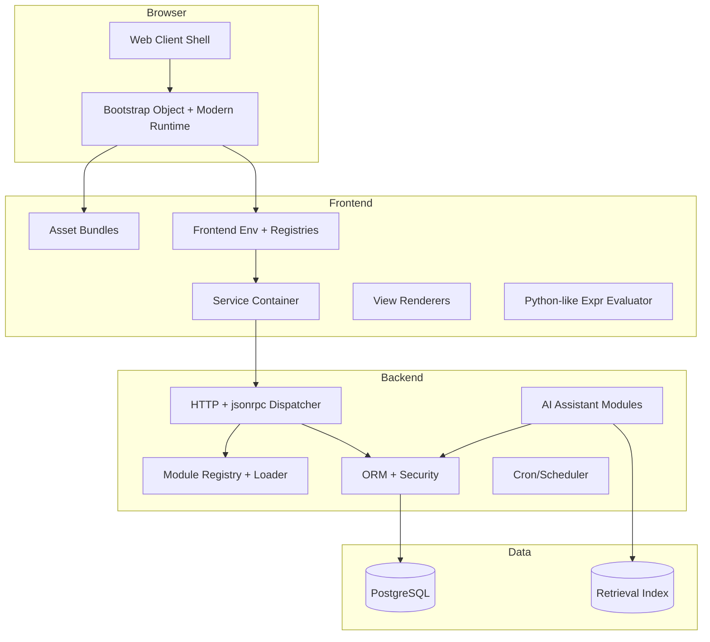

# System Architecture

## Overview

The AI-Powered Modular ERP Platform is a client/server system with metadata-driven UI, modular server, and optional AI capabilities. It targets Odoo 19.0 parity for core behaviour while implementing a clean-room reimplementation.

The frontend is now migrating toward a bundled modular runtime with explicit bootstrap, env, service startup, registries, and component-owned shell boundaries.

## System Boundary

## Module Lifecycle

1. **Discovery**: Scan `--addons-path` for directories with `__manifest__.py`
2. **Resolution**: Resolve `depends` acyclically; stable load order
3. **Load**: Import Python packages; load `data` files (XML/CSV) in order
4. **Registry**: Build per-database model registry
5. **Upgrade**: Run `migrate(cr, version)` for version bumps

## Data Flow

- **Request**: Browser → HTTP → Dispatcher → Controller/RPC
- **RPC**: JSON-RPC over POST; session from cookie/session store
- **ORM**: All data access via ORM; access rights + record rules enforced
- **AI**: Tools call ORM under user context; audit log for all invocations

## Multi-Database Tenancy

- `--db-filter` selects database per request
- Each database has its own registry and module set
- `--no-database-list` recommended for multi-tenant hosting

## Deployment Topology

- **Single process**: Default; HTTP on port 8069
- **Multi-worker**: `--workers` N; prefork model
- **Real-time**: Gevent worker on `--gevent-port` 8072; `/websocket/` proxied to it

## Parity Targets

- Module manifest keys, dependency resolution, data loading order
- ORM recordset semantics, prefetch, computed fields
- Security: access rights + record rules at every entrypoint
- HTTP: static serving, jsonrpc, controller routing

## Non-Goals

- Full Odoo addon ecosystem
- Legacy XML-RPC/JSON-RPC external API (target JSON-2)
- Exact Odoo UI pixel parity
- Verbatim copy of Odoo frontend source

## Compatibility Notes (Odoo 19)

- Python >= 3.10, PostgreSQL >= 13
- External JSON-2 replaces legacy RPC; legacy removal in Odoo 20
- Default server-wide modules: base, rpc, web
